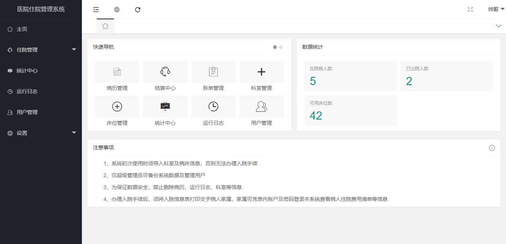
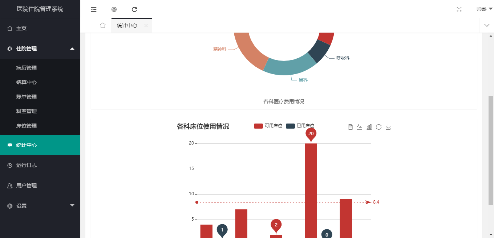
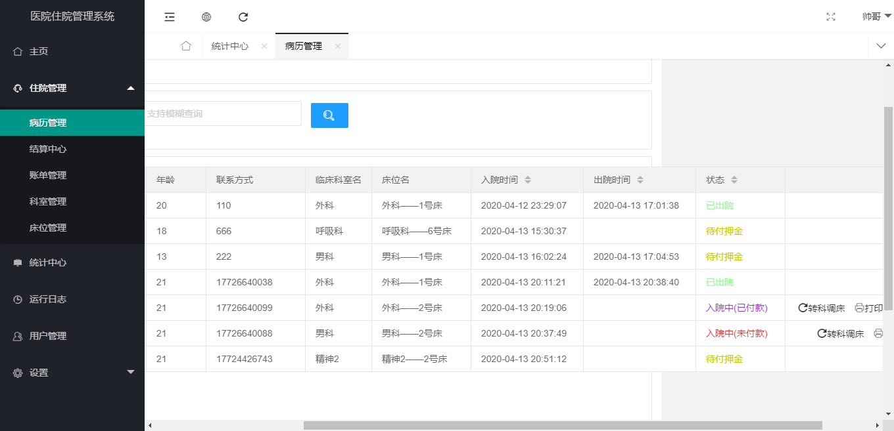

## 住院系统

作者：亚双义、一真

时间：2020年4月10日~2020年4月12日

实现功能：Web管理系统，两个用户：管理员、病人家属

实现技术：LayUI+asp.net MVC+MySQL+echarts

平台：Visual Studio 2017

---

### 效果截图

- 登录界面

  

- 管理员

  

  

  

- 病人家属

  

  

---

### 备注

1. 数据库已放于项目根目录
2. 用低于2017版本的VS可能无法运行

